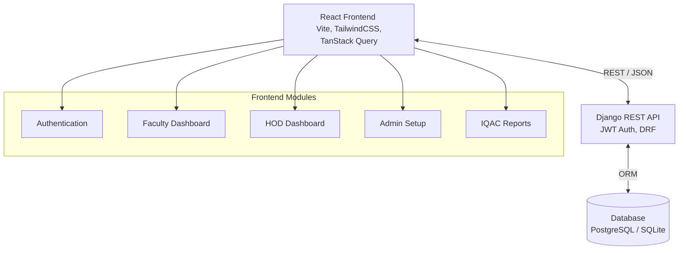
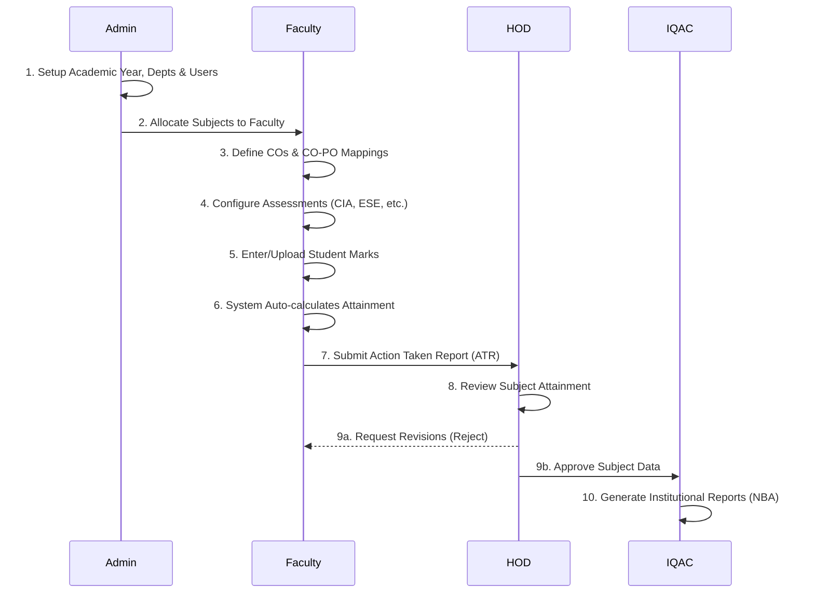

# SECE CO-PO Attainment Platform

A comprehensive, automated platform for managing, calculating, and analyzing Course Outcomes (CO) and Program Outcomes (PO) attainment. Built to streamline the accreditation process (like NBA/NAAC) by digitizing the entire workflow from marks entry to institutional reports.

---

## 🌟 Key Features

- **Automated Calculations:** Enter student marks and let the system automatically compute CO and PO attainment based on predefined weightages and thresholds.
- **Multi-Tiered Workflow:** Role-based dashboards for Admin, Faculty, HOD, and IQAC to ensure data integrity and proper review processes.
- **Excel Integrations:** Bulk upload student marks using Excel templates. Export detailed reports to Excel and PDF.
- **Dynamic Dashboards:** Visualize attainment trends, subject comparisons, and department performance using rich charts and analytics.
- **Action Taken Reports (ATR):** Integrated workflow for faculty to submit and HODs to review action plans for outcomes that fall below target thresholds.

---

## 🏛️ System Architecture

### Block Diagram



---

## 🔄 Workflow Diagram

The platform follows a strict hierarchical workflow to ensure data correctness before generating final reports.



---

## 🚀 Tech Stack

**Frontend:**
- React 18
- Vite
- TailwindCSS (Styling & UI)
- TanStack React Query (State & API Management)
- Framer Motion (Animations)
- Recharts (Data Visualization)
- React Router DOM

**Backend:**
- Python 3.12+
- Django 5.x
- Django REST Framework (DRF)
- SimpleJWT (Authentication)
- Pandas & OpenPyXL (Excel Processing)

---

## 🛠️ Getting Started

### Prerequisites
- Node.js (v18+)
- Python (v3.10+)
- PostgreSQL (Optional, defaults to SQLite for development)

### 1. Backend Setup

```bash
cd backend

# Create virtual environment
python -m venv venv
source venv/bin/activate  # On Windows: venv\Scripts\activate

# Install dependencies
pip install -r requirements.txt

# Run migrations
python manage.py migrate

# Create superuser
python manage.py createsuperuser

# Start development server
python manage.py runserver
```

### 2. Frontend Setup

```bash
cd frontend

# Install dependencies
npm install

# Start development server
npm run dev
```

### 3. Environment Variables
Create a `.env` file in the frontend directory:
```env
VITE_API_BASE_URL=http://localhost:8000/api
```

---

## 🛡️ Role Access Details

1. **Admin (`role: admin`)**: Complete access to system configurations, user management, and global settings.
2. **Faculty (`role: faculty`)**: Access to assigned subjects, marks entry, and CO-PO mapping.
3. **HOD (`role: hod`)**: Access to department-wide analytics, faculty reports, and approval workflows.
4. **IQAC (`role: iqac`)**: Access to college-wide analytics and NBA report generation.

---

## 📝 License

This project is licensed under the MIT License.
